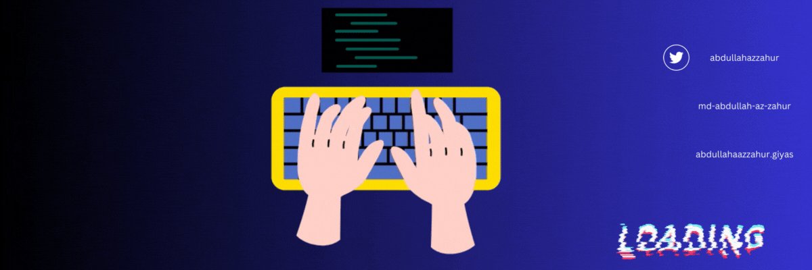

<h1 align='center'>Hi! 👋 I'm Md. Abdullah Az Zahur</h1>

🌟 Passionate Front-End Web Developer | 🚀 Building Interactive Web Experiences

---

## 🧑‍💻 About Me

Hello! I'm Md. Abdullah Az Zahur, a front-end web developer with a B.Sc. in Computer Science from North Western University. I specialize in creating interactive, user-friendly web applications and have a keen interest in emerging web technologies.

---

## 🛠️ Skills

### **Languages**

### **Frontend Frameworks & Libraries**

### **Backend & Tools**

### **UI Libraries & Styling**

---

## 🌟 Featured Projects

### [Jobify](https://job-nest-391e1.web.app/)
A collaborative job-seeking platform connecting users with opportunities through detailed listings and interactive features.

- **Key Contributions**:
  - Developed feature-rich interfaces including Single Job Page, Employee Dashboard, and more.
  - Enhanced functionality with multilingual support and improved UI consistency.
  - Integrated advanced UI components like React Headless UI and SweetAlert.
- **Technologies**: React, Tailwind CSS, Node.js, Express, MongoDB, Redux Toolkit

### [Survey Vista](https://survey-vista.web.app/)
A comprehensive MERN-based survey creation and participation platform featuring advanced role management and interactive dashboards.

- **Key Features**:
  - Designed role-based dashboards for users, surveyors, and admins.
  - Integrated payment gateway for Pro-user upgrades.
  - Developed secure authentication systems.
- **Technologies**: React, Tailwind CSS, Node.js, Express, MongoDB, Firebase

### [BD Art Gallery](https://bd-art-gallery.firebaseapp.com/)
An art gallery website showcasing Bangladeshi art with seamless CRUD operations and user authentication.

- **Key Features**:
  - Dynamic frontend with React components.
  - Social login options and responsive design.
- **Technologies**: React, Tailwind CSS, Node.js, Express, MongoDB

---

## 🏆 Achievements & Certifications

- **Complete Web Development Course** - Jhankar Mahbub
- **Communication Hacks** - Certificate
- **Communication Secrets** - Certificate (November 21, 2024)

---

## 📚 Education

- **M.Sc.Eng. in Information & Communication Technology (ICT)** (Running)
  - **Institute**: IICT, Khulna University of Engineering & Technology
- **B.Sc. in Computer Science & Engineering**
  - **University**: North Western University, Khulna
  - **CGPA**: 3.23/4.00

---

## 🌐 Connect with Me

---

## 📈 GitHub Stats

---

## 🎨 Interests & Hobbies

- **Sports Enthusiast**: Football, Cricket, Volleyball
- **Technology Explorer**: Passionate about emerging web technologies
- **Gaming & Interactive Media**: Exploring interactive technology and user experience design
- **Travel & Culture**: Enjoying diverse cultural experiences and perspectives

---

<h1 align='center'><i>Stay awesome! 🚀</i></h1>
